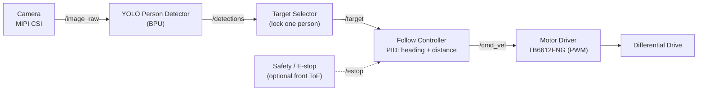

# Following Robot — Project Proposal (Stage 2: Build)

| | |
|---|---|
| **Project** | Following Robot — a vision-only person-following mobile robot |
| **Board** | D-Robotics RDK X5 |
| **Version** | 0.1 |
| **Date** | 2026-06-04 |
| **Author** | Mario (lavinama) |

> Stage 2 deliverable aggregating Challenges 1–3. Diagrams are inline Mermaid (render on GitHub). Timeline lives in [ROADMAP.md](ROADMAP.md); bill of materials detail in [SHOPPING.md](SHOPPING.md).

---

## Challenge 1 — Concept & Application Design

A small differential-drive robot that **detects and follows a person** using a single camera and a BPU-accelerated YOLO detector. It keeps the target centered and holds a safe following distance — a "follow-me" assistant (carry-cart / companion / hands-free camera).

- **Scenario:** Indoor — home, office, or warehouse aisle. Flat floor, moderate/even lighting, one target person at a time, low speed (≤ ~0.5 m/s).
- **User:** Someone who wants a hands-free follower (carry items, film themselves, mobility assist). Primary interaction: stand in view → robot locks on → walk → robot follows; stop → robot stops at safe distance.
- **Core AI capabilities:**
  - *Perception* — YOLO person detection (COCO class 0) on the BPU, on a continuous camera stream.
  - *Decision* — target selection + lock (follow one person, don't swap), follow control, lost-target recovery.
  - *Actuation* — differential drive: turn to center the person, throttle to hold distance.
- **Innovation / differentiation (vs a stock detection demo):** closed-loop *actuation* (not just boxes on screen); **target-lock** so it doesn't jump between people; smooth safe-distance control with graceful stop; **lost-target search** behavior; optional **second workload** (pose/gesture "stop" command) to satisfy multi-task.

### Measurable goals

| Metric | Target |
|---|---|
| Detection rate (BPU, 640×480) | ≥ 15 FPS |
| End-to-end control latency (frame → motor cmd) | < 150 ms |
| Following distance hold | 1.0–1.5 m, ±0.3 m |
| Re-acquire after target loss | < 3 s |
| Stop when person stops | within 30 cm, no contact |
| Continuous AI run for demo | ≥ 60 s without crash |

---

## Challenge 2 — AI System Architecture

### System flow (sensors → AI → decision → actuators)



### Module design

| Module (node) | Responsibility | Input | Output | Failure mode → handling |
|---|---|---|---|---|
| `camera_node` | Capture frames | camera device | `/image_raw` | disconnect → watchdog → stop motors |
| `detector_node` | YOLO person detection on BPU | `/image_raw` | `/detections` | no person → empty msg → controller stops/searches |
| `target_selector` | Pick & lock the followed person | `/detections` | `/target` (+ `lost` flag) | multiple people → keep locked track; lost → emit `lost` |
| `follow_controller` | PID heading (bbox center-x) + PID distance (bbox size) → velocity | `/target`, `/estop` | `/cmd_vel` | target lost → search then stop; too close → reverse/stop |
| `motor_driver_node` | `/cmd_vel` → PWM, clamp to safety limits | `/cmd_vel` | GPIO/PWM | e-stop → zero PWM immediately |
| `safety_node` *(optional)* | Front range → hard stop | ToF/ultrasonic | `/estop` | range < threshold → e-stop true |

### ROS 2 node graph

| Topic | Type | Pub → Sub | Rate |
|---|---|---|---|
| `/image_raw` | `sensor_msgs/Image` (or NV12) | camera_node → detector_node | ~30 Hz |
| `/detections` | `vision_msgs/Detection2DArray` | detector_node → target_selector | 15–30 Hz |
| `/target` | `vision_msgs/Detection2D` (+ state) | target_selector → follow_controller | 15–30 Hz |
| `/cmd_vel` | `geometry_msgs/Twist` | follow_controller → motor_driver_node | 20–50 Hz |
| `/estop` | `std_msgs/Bool` | safety_node → follow_controller | 20 Hz |

### Compute allocation

| Component | Device | Notes | Real-time constraint |
|---|---|---|---|
| YOLO person detection | **BPU** | yolov8n converted to RDK `.bin`; NV12/YUV420 input to avoid copies | ≥ 15 FPS |
| Target select + control + motor | **CPU** | lightweight math; low jitter matters more than throughput | control loop ≥ 20 Hz |
| Camera capture | CPU/ISP | hardware pipeline where available | 30 Hz |

**Executor model:** run `detector_node` in its own process/executor (heavy, BPU-bound); keep `target_selector` + `follow_controller` + `motor_driver_node` in a single multi-threaded executor for low-latency control. Use sensor-data QoS (best-effort) on `/image_raw`, reliable on `/estop`.

---

## Challenge 3 — Engineering Plan

### Bill of Materials (summary — see [SHOPPING.md](SHOPPING.md))

| Item | Qty | Spec / interface | Notes |
|---|---|---|---|
| RDK X5 | 1 | — | have it |
| Camera | 1 | MIPI CSI (IMX219) | tilt-mounted; USB webcam fallback |
| Chassis + TT motors + wheels + caster | 1 | 2WD/4WD differential | encoders optional |
| Motor driver | 1 | TB6612FNG (PWM/GPIO) | L298N fallback |
| Battery | 1 | 2S LiPo (7.4 V) | friendly for TT motors |
| 5 V buck converter | 1 | ≥ 4–5 A | clean board power |
| Switch + wiring + standoffs | — | — | camera tilt mount |
| Front ToF / ultrasonic | 0–1 | VL53L1X / HC-SR04 | optional e-stop only |

### Roadmap

Week-by-week milestones Jun 11 → Jul 15 in [ROADMAP.md](ROADMAP.md).

### Risk analysis

| # | Risk | Mitigation | Trigger to act |
|---|---|---|---|
| 1 | BPU detection FPS too low for smooth control | Use yolov8n, drop to 640×480 / 416, NV12 input, skip frames | < 10 FPS in tests |
| 2 | Motor current browns out / reboots the board | Separate motor & board power rails; proper 5 V buck; common ground | Board resets under motor load |
| 3 | Robot follows the wrong person | Target-lock via track continuity / simple appearance re-ID | Swaps target with 2+ people in frame |
| 4 | Follow loop oscillates / overshoots | PID tuning, deadband, velocity clamps, command smoothing | Visible wobble / overshoot |
| 5 | Thermal throttling on long runs | Heatsink + fan, monitor temps, lower FPS if hot | Temp high, FPS drops mid-run |
| — | Parts shipping delay | Order now; USB-webcam + bench-test fallback | Parts not arrived by Jun 22 |

### Repository structure

```
rdk-x5-following-robot/
├── README.md              # quick start, demo links
├── LICENSE
├── src/
│   ├── perception/        # detector_node (YOLO on BPU)
│   ├── tracking/          # target_selector
│   ├── control/           # follow_controller
│   ├── drivers/           # motor_driver_node (TB6612FNG)
│   └── bringup/           # launch files, params
├── launch/                # follow.launch.py
├── models/                # yolov8n .bin/.hbm + labels
├── config/                # PID gains, camera calib, limits
├── docs/                  # architecture, benchmarks, calibration, known issues
└── scripts/               # flashing notes, setup, benchmark
```
