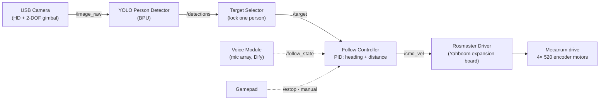

# Following Robot — Project Proposal (Stage 2: Build)

| | |
|---|---|
| **Project** | Following Robot — a vision-only person-following mobile robot |
| **Brain** | D-Robotics RDK X5 **4GB** (10 TOPS BPU) |
| **Platform** | Yahboom **ROSMASTER M1** (mecanum, 4× 520 encoder motors, ROS expansion board, 12.6 V battery, USB camera, voice module) |
| **Version** | 0.2 |
| **Date** | 2026-06-05 |
| **Author** | Mario (lavinama) |

> Hardware is purchased — design is now concrete around the M1. Diagrams are inline Mermaid. Timeline in [ROADMAP.md](ROADMAP.md); hardware manifest in [SHOPPING.md](SHOPPING.md).

---

## Challenge 1 — Concept & Application Design

A ROSMASTER M1 mecanum robot that **detects and follows a person** using its USB camera and a BPU-accelerated YOLO detector — keeping the target centered and holding a safe following distance. A hands-free "follow-me" companion/cart.

- **Scenario:** Indoor — home/office/aisle. Flat floor, even lighting, one target at a time, ≤ ~0.5 m/s.
- **User:** Wants a hands-free follower. Interaction: stand in view → (say "follow") → robot locks on and trails you → stop / say "stop" → it halts at a safe distance.
- **Core AI capabilities:** *perception* — YOLO person detection on the **BPU**; *decision* — target lock + follow control + lost-target recovery; *actuation* — mecanum drive (turn/approach, optional strafe).
- **Differentiation vs a stock demo:** closed-loop *actuation* (not just on-screen boxes); **target-lock** (won't swap people); **voice command** start/stop (second workload); graceful safe-distance stop + lost-target search; optional **active camera tracking** via the 2-DOF gimbal.

### Measurable goals
| Metric | Target |
|---|---|
| YOLO detection (BPU, 640×480) | ≥ 15 FPS |
| Frame → motor-command latency | < 150 ms |
| Following distance hold | 1.0–1.5 m, ±0.3 m |
| Re-acquire after target loss | < 3 s |
| Voice command → state change | < 1.5 s |
| Continuous multi-task run (demo) | ≥ 60 s, no crash, on 4GB headless |

---

## Challenge 2 — AI System Architecture

### System flow



### Module design
| Module (node) | Responsibility | In | Out | Failure → handling |
|---|---|---|---|---|
| `camera_node` | USB camera capture | camera | `/image_raw` | disconnect → watchdog → stop |
| `detector_node` | YOLO person detection on **BPU** | `/image_raw` | `/detections` | no person → empty → controller searches/stops |
| `target_selector` | lock & track one person | `/detections` | `/target` (+`lost`) | 2+ people → keep locked track; lost → `lost` |
| `follow_controller` | PID heading (bbox center-x) + distance (bbox size / depth) → velocity | `/target`, `/follow_state`, `/estop` | `/cmd_vel` | lost → search→stop; too close → reverse/stop |
| `rosmaster_driver` *(Yahboom)* | `/cmd_vel` → mecanum wheel speeds → expansion board; publishes odom/IMU | `/cmd_vel` | motors, `/odom`, `/imu` | e-stop → zero velocity |
| `voice_node` | recognize "follow"/"stop" | mic | `/follow_state` | low confidence → ignore |
| `pan_tilt_node` *(optional)* | keep camera on target via 2-DOF servos | `/target` | servo cmd | center → hold |

### ROS 2 node graph (Humble)
| Topic | Type | Pub → Sub | Rate |
|---|---|---|---|
| `/image_raw` | `sensor_msgs/Image` | camera → detector | ~30 Hz |
| `/detections` | `vision_msgs/Detection2DArray` | detector → selector | 15–30 Hz |
| `/target` | `vision_msgs/Detection2D` (+state) | selector → controller | 15–30 Hz |
| `/cmd_vel` | `geometry_msgs/Twist` | controller → rosmaster_driver | 20–50 Hz |
| `/follow_state` | `std_msgs/String` | voice → controller | event |
| `/estop` | `std_msgs/Bool` | gamepad/safety → controller | 20 Hz |

### Compute allocation (RDK X5 4GB)
| Component | Device | Notes |
|---|---|---|
| YOLO person detection | **BPU** | yolov8n → RDK `.bin`; NV12/YUV input. BPU does the heavy work, sparing RAM. |
| Selector + control + voice | **CPU** | lightweight; low jitter matters |
| Motor/encoder/IMU loop | expansion board (offboard) | Yahboom firmware; RDK just sends `cmd_vel` |
| **RAM budget (4GB)** | — | **run headless** (no desktop GUI ≈ +1 GB free); light model; **voice via cloud (Dify), not local LLM**; optional zram |

**Two concurrent workloads (Stage 3):** (A) YOLO detection on BPU + (B) follow-control loop on CPU — already satisfies the requirement; (C) voice command recognition strengthens it.

---

## Challenge 3 — Engineering Plan

### Bill of Materials
Acquired — ROSMASTER M1 kit + RDK X5 4GB. Full manifest in [SHOPPING.md](SHOPPING.md). No further core purchases.

### Roadmap
Week-by-week Jun 11 → Jul 15 in [ROADMAP.md](ROADMAP.md).

### Risk analysis
| # | Risk | Mitigation | Trigger |
|---|---|---|---|
| 1 | **Kit shipping** misses build window (AliExpress) | Front-load all non-kit work (YOLO on bare board, controller vs recorded video, ROS 2 setup); assemble when it lands | not arrived by ~Jun 22 |
| 2 | **4GB RAM** pressure | Headless runtime, yolov8n @ 640×480, cloud voice, zram | swapping / OOM in tests |
| 3 | Yahboom software vs RDKOS integration | Use Yahboom's **RDK X5** image/Rosmaster pkg; verify Ubuntu 22.04 + Humble | driver/import errors |
| 4 | Follow loop oscillates (mecanum) | PID tuning, deadband, velocity clamps, smoothing; gamepad e-stop while tuning | wobble/overshoot |
| 5 | Target swapping between people | track continuity / simple re-ID; fall back to "largest central person" | follows wrong person |
| — | Thermal on long runs | kit **cooling fan** + monitor temps; drop FPS if hot | temp high mid-run |

### Repository structure
```
rdk-x5-following-robot/
├── README.md  ·  PROPOSAL.md  ·  ROADMAP.md  ·  SHOPPING.md
├── src/
│   ├── perception/   # detector_node — YOLO on BPU
│   ├── tracking/     # target_selector (lock one person)
│   ├── control/      # follow_controller (PID → cmd_vel)
│   ├── voice/        # voice_node → /follow_state
│   └── bringup/      # launch + params; wraps Yahboom Rosmaster driver
├── launch/           # follow.launch.py
├── models/           # yolov8n .bin + labels
├── config/           # PID gains, camera calib, limits, headless/RAM notes
├── docs/             # architecture, benchmarks, calibration, known issues
└── scripts/          # setup, benchmark
```
*(Motor control = Yahboom `Rosmaster_Lib` dependency — no hand-written driver.)*
