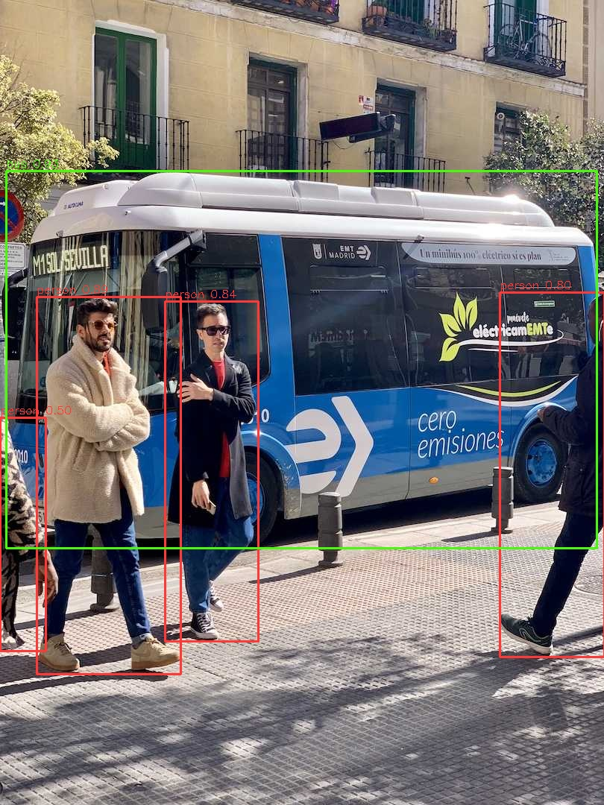

# RDK X5 Following Robot

A vision-guided **person-following robot**: a Yahboom **ROSMASTER M1** mecanum base driven by a
**D-Robotics RDK X5 (4GB, 10 TOPS)**, built for the
[Robotics Dream Keeper Challenge](https://github.com/D-Robotics/Robotics-Dream-Keeper-Challenge).
This documents my Stage 1 ("Ignite") work and grows through Stages 2–3.

- **Participant:** Mario
- **Brain:** RDK X5 — **4GB**, Sunrise 5, 10 TOPS BPU
- **OS:** RDKOS 3.5.0 Desktop (Ubuntu 22.04, arm64)
- **Host:** MacBook Pro 16" (M4 Pro), macOS 15.6.1
- **Platform (Stage 2–3):** ROSMASTER M1 — mecanum, 4× 520 encoder motors, USB HD camera, voice module. *Shipping; **Stage 1 below is board-only** and does not need it.*

> Official submission draft: `submission/Mario-Project-FollowingRobot.md` — copy into a fork of the challenge repo's `projects/` folder when Stage 1 is complete.

---

## Stage 1 — Ignite

Goal: power on the board and run an on-device AI inference task. **Doable with the board alone.**

### Deliverables checklist
- [x] **Challenge 1 — Board bring-up:** flash OS → USB-gadget network → SSH (`uname -a`: `6.1.83 aarch64`)
- [x] **Challenge 2 — Sensor:** DDR/CPU thermal sensors + onboard ACT LED blink (`scripts/challenge2_sensor.py`)
- [x] **Challenge 3 — First AI task:** YOLO11n detect on the BPU — forward 13.1 ms (~76 FPS), bus 0.93 + 4× person
- [x] Screenshots: **A** (SSH) · **B** (LED clip) · **C** (detection log + annotated image) — all in [`docs/images/`](docs/images/)
- [ ] Discord Stage 1 check-in → permalink below
- [ ] Showcase PR opened to the official `projects/` folder

---

## 1. Flash the OS image

- **Image:** `rdk-x5-ubuntu22-preinstalled-desktop-3.5.0-arm64.img.xz`
  ([archive](https://archive.d-robotics.cc/downloads/os_images/rdk_x5/rdk_os_3.5.0-2026-4-9/) · md5 `b39cd58ab65e838929063e4f1e184d0b`)
- **Tool:** RDK Studio (macOS) — _Choose device → RDK X5 / X5 Module → Choose image → local file → Refresh drives → select card → Stable mode → Start flashing._ (Fallback: balenaEtcher.)
- **Card:** SanDisk Ultra 64GB (A1/U1/V10), read via an Anker 7-in-1 USB-C hub → MacBook.

> 📸 **Screenshot A:** flashing tool (post-flash) + active SSH terminal.
> **Evidence:** [`docs/images/screenshot-A-ssh.png`](docs/images/screenshot-A-ssh.png) — SSH session over the USB-C gadget (`ssh sunrise@192.168.128.10`, Ubuntu 22.04.5 / kernel 6.1.83 aarch64 banner).

## 2. Power, network & SSH setup

- **Power:** wall USB-C supply — official spec is **5V/5A** (a 27W+ PD charger works). D-Robotics warns
  *against* powering from a computer's USB port (brown-outs / reboot loops).
- **Two Type-C ports** (bring-up gotcha): the X5 has separate Type-C ports for **power** and for
  **QuickLink / USB-device** (ADB + gadget ethernet `192.168.128.10`) — one cable can't do both jobs.
- **LEDs:** green = power; orange blinking = system running normally (RDK OS ≥ 3.1).
- **Default login:** `sunrise` / `sunrise` (also `root` / `root`).
- **USB-C gadget from macOS (what worked):** plug the Mac into the **QuickLink** Type-C → a CDC network
  interface appears, but the board serves no DHCP. Give the Mac side a static IP, then SSH:
  ```bash
  sudo ifconfig <enX> inet 192.168.128.5 netmask 255.255.255.0   # enX = the new interface
  ssh sunrise@192.168.128.10                                      # → uname -a
  ```
  Verified: `Linux ubuntu 6.1.83 aarch64`, Ubuntu 22.04.5 LTS (RDKOS 3.5.0).
- **Wi-Fi without a monitor:** over the USB SSH session,
  `sudo nmcli device wifi connect '<SSID>' password '<pw>'` — board then reachable on its Wi-Fi IP too.
- **Other defaults:** wired Ethernet is static `192.168.127.10`.
- **Gotcha — first-boot clock:** no RTC battery, so the clock starts in 2000 and **HTTPS/TLS fails**
  (certs "not yet valid") until NTP syncs, a minute or two after the network comes up. `ping 8.8.8.8`
  working while `curl https://…` fails silently is the tell; check `timedatectl`.

## 3. Sensor (Challenge 2) — onboard thermal sensors + ACT LED

The USB camera ships with the M1 (not here by the deadline) and I had **no discrete components on hand**
(no LED/resistor/jumpers — board only). So the sensor task uses what the board itself provides:

- **Sensor (input):** the SoC's **DDR + CPU thermal sensors** (`/sys/class/thermal/thermal_zone{0,1}`),
  read every tick in Python.
- **Peripheral (output):** the onboard **ACT LED** (`/sys/class/leds/ACT`) — the GPIO-driven status LED.
  The script takes it over from the kernel `heartbeat` trigger, blinks it at 1 Hz in sync with the
  sensor reads, and restores the heartbeat on exit.

Script: [`scripts/challenge2_sensor.py`](scripts/challenge2_sensor.py) (also at `~/challenge2_sensor.py` on the board).

```bash
sudo python3 ~/challenge2_sensor.py        # 60 s run; password: sunrise
```
Sample output (real run):
```
[  0.0s] ACT LED ON   |  thermal-ddr: 58.1C  thermal-cpu: 57.2C
[  0.5s] ACT LED off  |  thermal-ddr: 57.8C  thermal-cpu: 56.8C
...
ACT LED restored to heartbeat trigger.
```

> **With parts (alternative):** classic external blink — LED anode → ~330 Ω → physical **pin 11**,
> cathode → GND (pin 6), driven via `Hobot.GPIO` (RPi.GPIO-compatible, preinstalled). Saved for when
> the M1 kit arrives; any of camera / IMU / GPIO / mic / motor satisfies Challenge 2.
>
> 📸 **Screenshot B:** the ACT LED blinking under script control (short clip/photo) + the sensor log.
> **Evidence:** [`docs/images/challenge2-act-led-blink.mp4`](docs/images/challenge2-act-led-blink.mp4) — short clip (1080×1920, H.264) of the ACT LED blinking under script control with the live sensor log on screen.

## 4. First AI task (Challenge 3) — YOLO on the BPU (static image)

Runs on-device on a bundled test image — **no camera required**.

```bash
# 1. Get the samples (on the board)
git clone --depth 1 https://github.com/D-Robotics/rdk_model_zoo
cd rdk_model_zoo/samples/vision/ultralytics_yolo/runtime/python

# 2. Run detection — run.sh fetches the X5 BPU model itself, then infers
#    on the bundled test image (datasets/coco/assets/bus.jpg)
bash run.sh detect
```
- **Model:** `yolo11n_detect_bayese_640x640_nv12.bin` (YOLO11n, 640×640, NV12 — compiled for the X5's Bayes-e BPU)
- **Exact command I ran:** `cd ~/rdk_model_zoo/samples/vision/ultralytics_yolo/runtime/python && bash run.sh detect`
- **Result:** `bus: 0.93` + 4× `person` (0.89 / 0.84 / 0.80 / 0.50) on `bus.jpg`; annotated output saved to
  `test_data/result_detect.jpg`. **Forward time: 13.1 ms on one BPU core (~76 FPS raw)** — load 149 ms,
  pre-process 12.1 ms, post-process 10.0 ms. Great early signal for the Stage 2 person-follower budget.

*Lighter alternative if YOLO setup is heavy:* `samples/vision/mobilenetv2` image classification on a test image.

> 📸 **Screenshot C:** the annotated detection output, running on the board.



Terminal log of the run: [`docs/images/screenshot-C-detect-log.png`](docs/images/screenshot-C-detect-log.png) (timings + per-detection output).

## Dependencies
- `git`; D-Robotics **BPU runtime** + `Hobot.GPIO` (both preinstalled on RDKOS).
- Python: `opencv-python`, `numpy` (`pip3 install opencv-python numpy` if missing).
- Model `.bin` from `rdk_model_zoo` (`model/download_model.sh`).

## Community check-in
- Discord intro / Stage 1 post: `<permalink>`

---

## Roadmap (Stage 2–3 — ROSMASTER M1 + RDK X5 4GB)
- **Stage 2 — Build:** design the person-follower — ROS 2 graph `camera → YOLO (BPU) → target-lock → follow_controller → mecanum`, with voice as a second workload. *(Full plan on the `docs/stage2-plan` branch.)*
- **Stage 3 — Launch:** assemble the M1, integrate real-time BPU YOLO following + voice + safety, benchmark on 4 GB headless, record the demo video.
